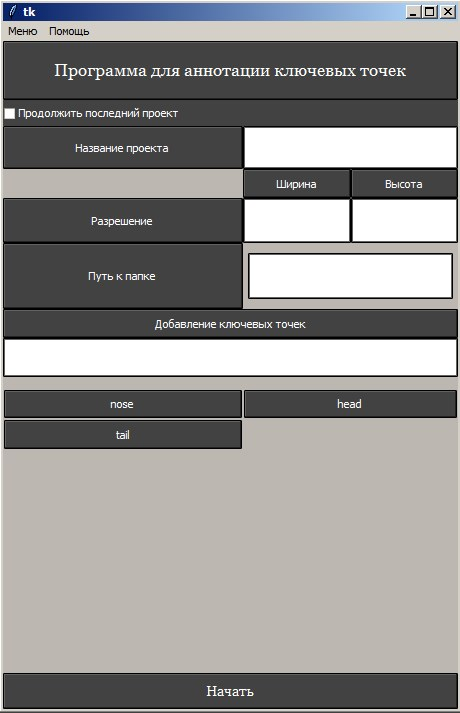
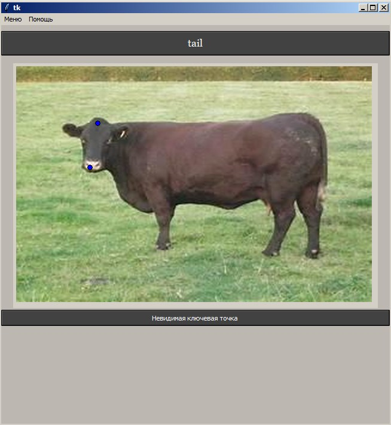
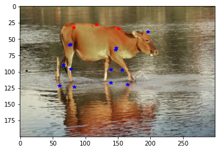
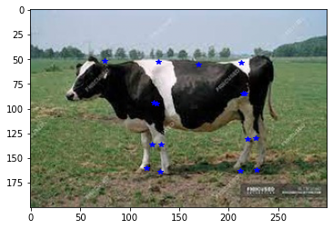
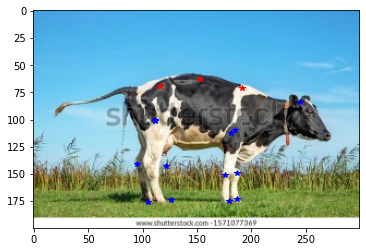
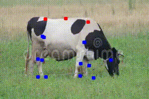

# CowPoseDetection-KazATU
# Machine learning model for key-points localization of cattle using Keras + custom DataAugmentation
### based on [this webpage](http://flothesof.github.io/convnet-face-keypoint-detection.html) 

[ML Model in Keras](https://github.com/Yerlan999/CowPoseDetection-KazATU/blob/main/modules/keras_model_spec.ipynb) 

# Custom offline keypoint annotation tool with less mouse clicks in Tkinter. 
1. automaticaly creates csv file with all keypoints defined by user
2. saves resized images, both colored and grayscaled in corresponding folders
3. possibility of continuing last session
4. undoing both keypoint declaration and keypoint assignment

 

*Screenshots* 
 
 
[code is here](https://github.com/Yerlan999/CowPoseDetection-KazATU/blob/main/modules/main.py) 

 

# Output of the Trained Model  

  
  
  

  
  

