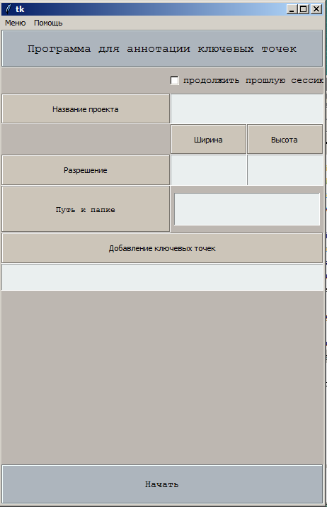
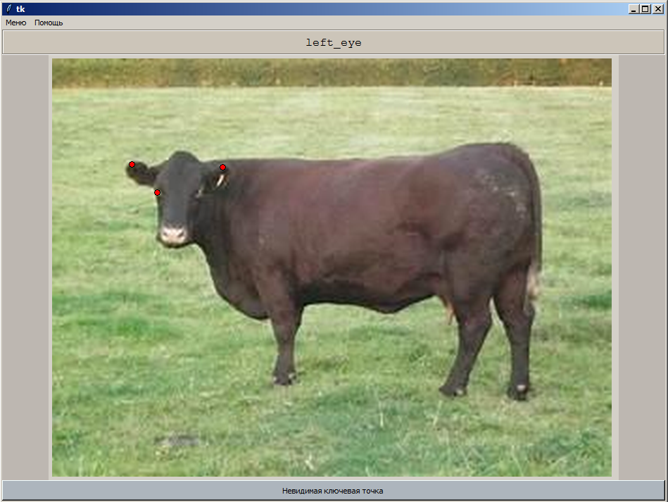
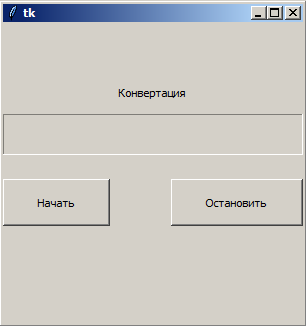

# CowPoseDetection-KazATU
# Machine learning model for key-points localization of cattle using Keras
### based on [this webpage](http://flothesof.github.io/convnet-face-keypoint-detection.html) 

[ML Model in Keras](https://github.com/Yerlan999/CowPoseDetection-KazATU/blob/main/modules/keras_model.ipynb)

# Custom offline keypoint annotation tool with less mouse clicks in Tkinter. 
*Screenshots* 
 
 
[code here](https://github.com/Yerlan999/CowPoseDetection-KazATU/blob/main/modules/main.py) 

# Tool to convert JPEG images to String.  
*Screenshot* 
 
[code here](https://github.com/Yerlan999/CowPoseDetection-KazATU/blob/main/modules/converter.py) 
